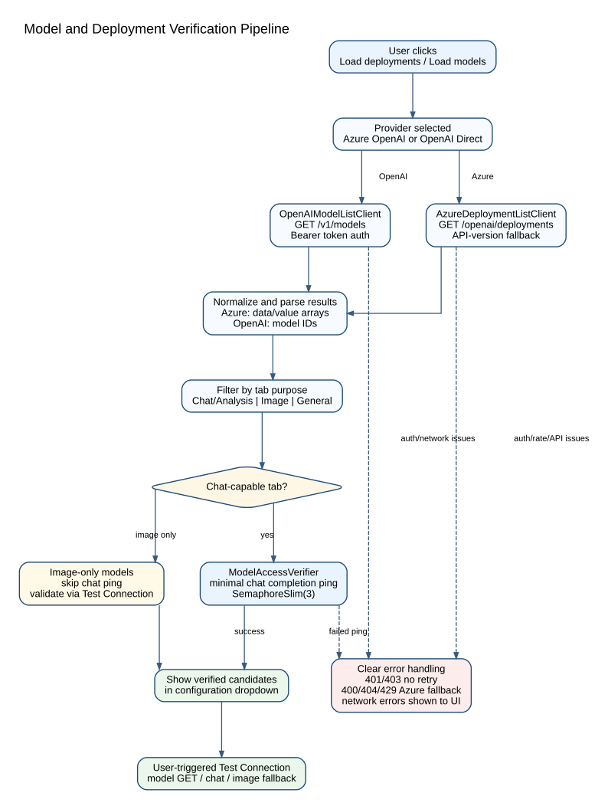
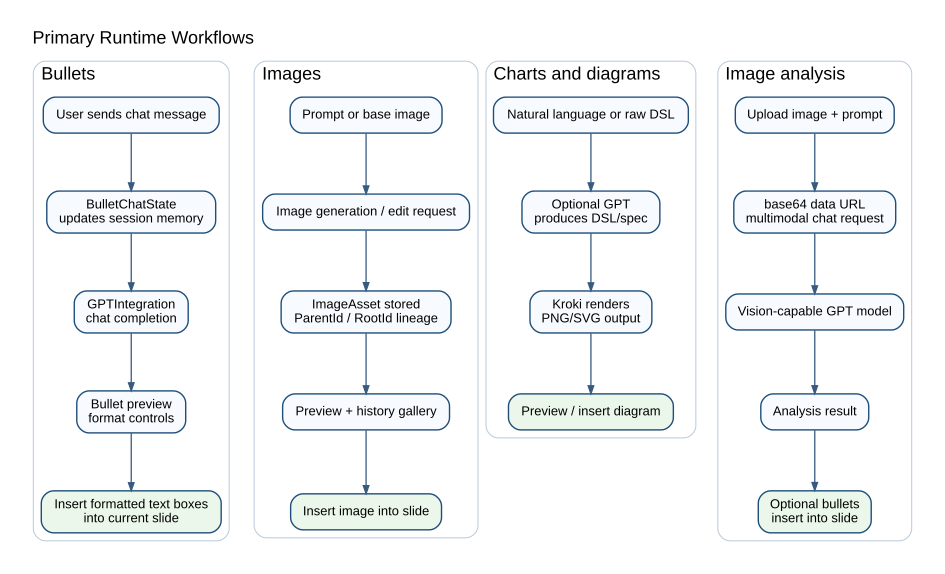

# AI-based Document Generator for PowerPoint

> Portfolio evidence repository for a proprietary Microsoft PowerPoint VSTO add-in that integrates AI-assisted slide authoring directly into PowerPoint.

[](#)
[](#)
[](#)
[](#)

## Executive summary

**Document Generator** is a PowerPoint VSTO COM add-in that brings AI-assisted presentation creation into a native Microsoft Office workflow. It provides a custom task pane with dedicated modules for bullet generation, image generation/editing, chart and diagram generation, and image analysis. The add-in supports Azure OpenAI and OpenAI Direct, uses a central AI integration facade, verifies model/deployment access before use, stores credentials with Windows DPAPI, and can be deployed through ClickOnce or an optional Inno Setup wrapper.

This public repository intentionally contains **documentation, architecture diagrams, process flows, and portfolio evidence only**. The production source code, installers, API configuration, and proprietary implementation details remain private.

## Why this project matters

Modern presentation workflows are fragmented: content is drafted in one tool, AI output is copied from another tool, diagrams are rendered elsewhere, and final slide formatting happens manually in PowerPoint. Document Generator reduces that friction by integrating AI functionality directly into the PowerPoint task pane while preserving enterprise-relevant concerns such as provider configurability, credential isolation, deployment packaging, and per-presentation session state.

## Core capabilities

| Area | Capability | Engineering relevance |
|---|---|---|
| Text generation | Multi-turn chat-driven bullet generation with language and bullet-format controls | UI orchestration, stateful conversation handling, provider routing |
| Image generation | Prompt-based image generation, iterative edits, base-image upload, resolution selection and image history | asset lineage, session-scoped media state, binary result handling |
| Charts & diagrams | GPT-generated or raw Vega-Lite / Mermaid / D2 / PlantUML / Graphviz rendered via Kroki | DSL generation, external renderer integration, configurable chart options |
| Image analysis | Vision-capable GPT model receives image as base64 data URL and returns analysis text | multi-modal request construction, image preprocessing, UX feedback |
| Secure configuration | Credentials stored per Windows user via DPAPI-encrypted configuration file | local secret management, atomic config persistence |
| Model verification | Azure/OpenAI deployment listing, tab-purpose filtering, and concurrent ping validation | robust API discovery, resilience to provider/version differences |
| Deployment | ClickOnce-first installation plus optional Inno Setup wrapper | Office add-in packaging, user-level installation, enterprise rollout path |

## High-level architecture

The add-in is organized around a VSTO host, a WinForms task pane, a centralized GPT integration layer, a secure configuration store, per-presentation session management, and provider-specific discovery/verification clients.


## API verification and provider routing

A central design goal is to avoid exposing non-working deployments to the user. Candidate Azure deployments or OpenAI models are listed, filtered by task purpose, and verified through a controlled access check before they appear in configuration dropdowns.



## Runtime workflow overview



## Engineering highlights

- **Office-native integration:** VSTO add-in hosted inside Microsoft PowerPoint with a docked custom task pane.
- **Separation of concerns:** UI, service configuration, provider routing, model discovery, access verification, and session state are separated into dedicated components.
- **Provider abstraction:** Azure OpenAI and OpenAI Direct are selectable per feature area instead of hard-coded globally.
- **Security-aware local configuration:** API keys are not shipped in source and are persisted per Windows user with DPAPI encryption.
- **Resilient Azure endpoint handling:** endpoint normalization handles resource-root URLs, full REST URLs with deployment names, portal URL variants, invisible characters and stray quotes.
- **Multi-API-version resilience:** Azure deployment listing can fall back through several API versions and handles both `data` and `value` response shapes.
- **Session isolation:** Each presentation gets isolated chat memory and image history, reducing cross-document state leakage.
- **Production deployment path:** ClickOnce is the recommended installation method, with an optional Inno Setup bootstrapper for Start Menu shortcuts and enterprise-style distribution.

## Repository structure

```text
.
├── README.md
├── CHANGELOG.md
├── LICENSE.md
├── NOTICE.md
└── docs/
    ├── architecture.md
    ├── user-workflows.md
    ├── security-and-privacy.md
    ├── deployment.md
    ├── portfolio-evidence.md
    ├── assets/
    │   ├── architecture-overview.svg
    │   ├── api-verification-pipeline.svg
    │   ├── runtime-flows.svg
    │   └── deployment-flow.svg
    └── diagrams/
        ├── architecture-overview.dot
        ├── api-verification-pipeline.dot
        ├── runtime-flows.dot
        └── deployment-flow.dot
```

## What is intentionally not published

To protect the proprietary value of the software, this repository does **not** publish:

- production source code,
- API keys, endpoints, deployment names or configuration files,
- installer payloads or signed binaries,
- proprietary prompting templates or implementation-specific logic,
- customer data, internal PEM/RWTH assets or private environment details.

## Author and ownership

Copyright (c) Martin Khadjavian. All rights reserved.

Contact: [info@martinkhadjavian.com](mailto:info@martinkhadjavian.com)  
Portfolio: [martinkhadjavian.com](https://martinkhadjavian.com)

This repository is provided as a professional showcase and technical evidence layer for recruitment, portfolio review, and architecture discussion. No license to copy, modify, distribute, commercialize, reverse engineer, or reuse the underlying software is granted unless explicitly agreed in writing.
