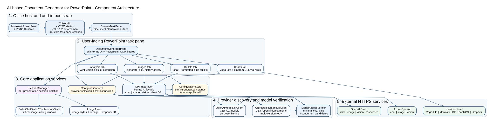

# Architecture

This document summarizes the architecture of the proprietary **AI-based Document Generator for PowerPoint** without exposing implementation-sensitive source code.

## Architectural objective

The system is designed to make AI-assisted slide creation available directly inside PowerPoint while preserving maintainability, configurability, and a secure local configuration model. The architecture follows a layered Office-add-in approach:

1. **PowerPoint host layer** - Microsoft PowerPoint and the VSTO runtime load the COM add-in.
2. **Add-in bootstrap layer** - `ThisAddIn` initializes TLS settings, creates the `DocumentGeneratorPane`, and attaches it as a PowerPoint `CustomTaskPane`.
3. **UI orchestration layer** - `DocumentGeneratorPane` coordinates user interactions across Bullets, Images, Charts and Analysis tabs.
4. **AI service layer** - `GPTIntegration` centralizes chat completions, bullet generation, image generation/editing, vision chat, chart DSL generation and connection tests.
5. **Configuration layer** - `ConfigurationForm`, `ServiceConfiguration` DTOs and `ConfigurationStore` manage provider selection and encrypted user-scoped settings.
6. **Discovery/verification layer** - provider-specific list clients and `ModelAccessVerifier` populate only valid service candidates.
7. **Session layer** - `SessionManager` and `PresentationSession` isolate memory and image history by active presentation.
8. **External services** - Azure OpenAI, OpenAI Direct and Kroki are called through HTTPS according to user configuration.

## Main components

| Component | Responsibility |
|---|---|
| `ThisAddIn` | VSTO startup, TLS enforcement and task pane creation. |
| `DocumentGeneratorPane` | Main WinForms user interface and PowerPoint COM interop surface. |
| `ConfigurationForm` | Multi-tab provider configuration for text, image, charts and image analysis services. |
| `ConfigurationStore` | DPAPI-encrypted persistence of the user-scoped `AppServiceConfiguration`. |
| `GPTIntegration` | Static facade for all AI-related service calls and connection tests. |
| `AzureDeploymentListClient` | Lists Azure OpenAI deployments with API-version retry and endpoint normalization. |
| `OpenAIModelListClient` | Lists OpenAI Direct models and filters by purpose. |
| `ModelAccessVerifier` | Confirms access to chat-capable model candidates using bounded concurrent pings. |
| `SessionManager` / `PresentationSession` | Maintains per-presentation chat memory, text memory and image history. |
| `ImageAsset` | Tracks generated/edited images, lineage, prompt metadata and optional response continuation IDs. |
| `PemApiConfigurationTool` | Optional standalone configuration utility sharing the same configuration model. |

## Key design decisions

### 1. Centralized AI facade

All AI calls are routed through `GPTIntegration` rather than scattered across UI handlers. This reduces duplication, creates a single point for provider routing, and makes connection testing and timeout handling more consistent.

### 2. Provider-per-feature configuration

Text, image generation, chart/diagram generation and image analysis are configured separately. This allows practical enterprise deployment patterns, for example using Azure OpenAI for chat while using a direct OpenAI image model for image editing.

### 3. Verification before selection

The configuration workflow does not blindly show every model/deployment returned by the provider. It lists, filters and verifies candidates before presenting them to the user, which improves UX and lowers support burden.

### 4. Per-presentation session isolation

State is keyed by the active presentation path or name. This avoids mixing chat memory and image history between presentations and gives predictable behavior during multi-document PowerPoint sessions.

### 5. Secure local settings

Credentials are not part of the source code or installer. They are entered after installation and stored in a user-scoped DPAPI-encrypted file.
