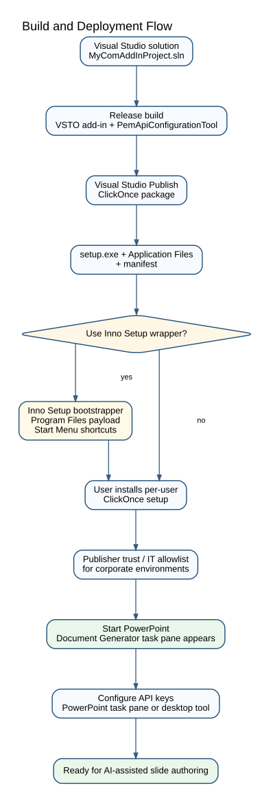

# Deployment overview

Document Generator is distributed as a Windows PowerPoint VSTO add-in.

## Requirements

| Requirement | Details |
|---|---|
| Operating system | Windows 10/11 |
| Office host | Microsoft PowerPoint, Microsoft 365 or Office 2019+ recommended |
| Runtime | .NET Framework 4.8 |
| Office runtime | Visual Studio 2010 Tools for Office Runtime |
| Network | Access to configured Azure OpenAI, OpenAI Direct and/or Kroki endpoints |

## ClickOnce deployment

The recommended deployment path is ClickOnce:

1. publish the VSTO add-in from Visual Studio,
2. distribute `setup.exe`, the application files folder and the manifest as one complete publish output,
3. install per Windows user,
4. start PowerPoint and open the Document Generator task pane,
5. configure API keys after installation.

## Optional Inno Setup wrapper

For enterprise-style installation, an optional Inno Setup wrapper can install payload files, run the ClickOnce setup, and create Start Menu shortcuts such as **Configure API keys**.

## Build constraints

- Target framework: .NET Framework 4.8.
- Platform: Any CPU.
- Assembly name remains `MyComAddIn` for COM/VSTO compatibility.
- Production builds should be signed for easier trust handling in corporate environments.

